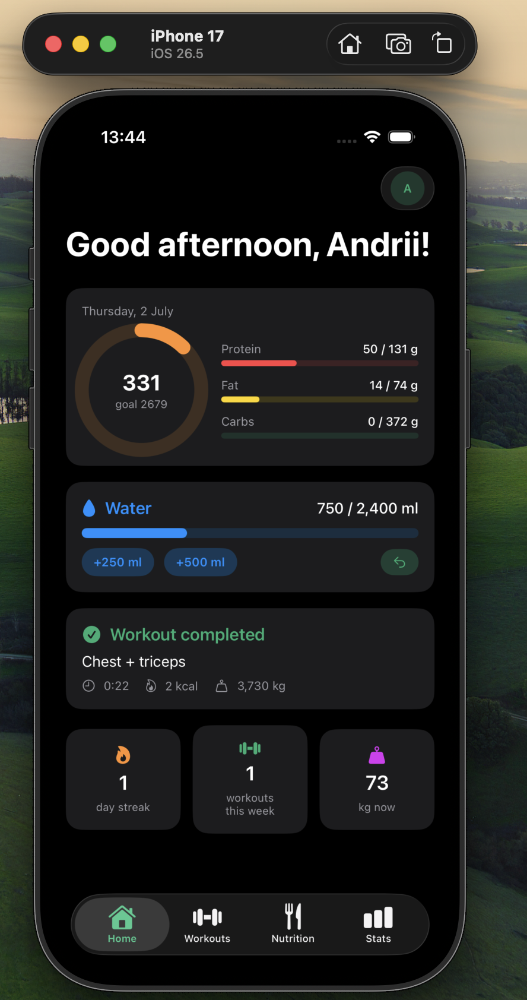
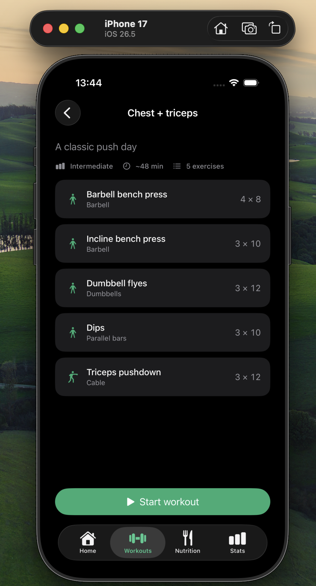
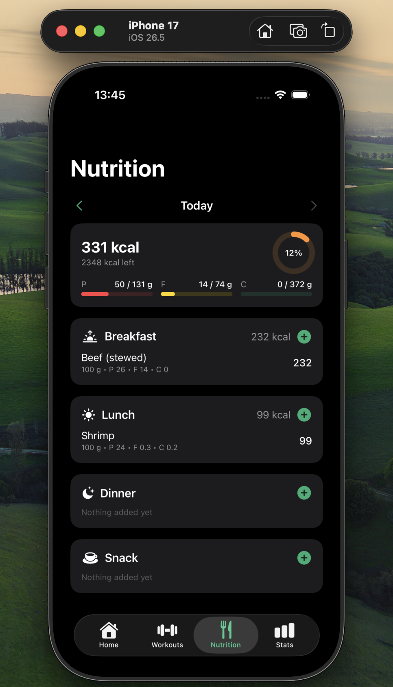
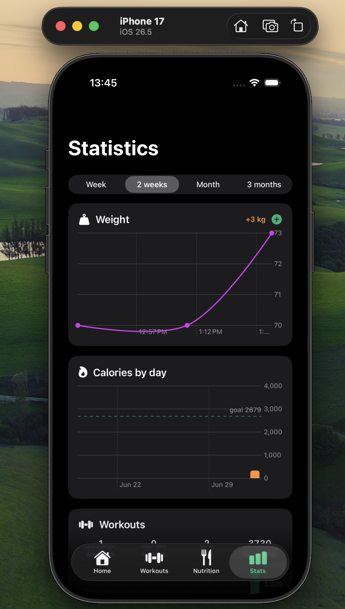
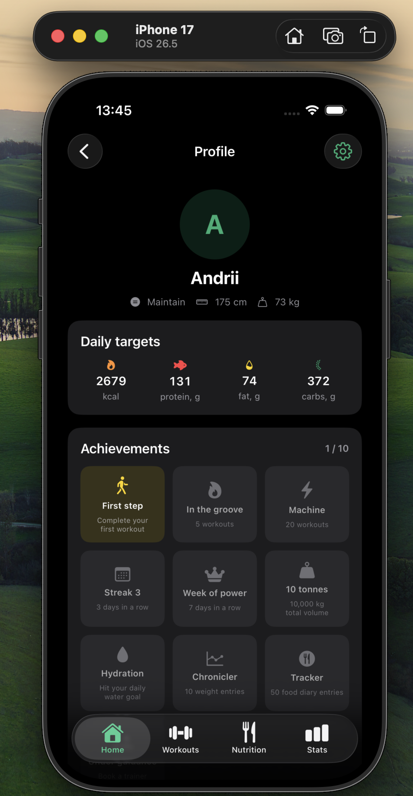

# FitTrack

FitTrack is a SwiftUI fitness tracking app for iOS. It combines onboarding, workout planning, nutrition logging, progress charts, profile goals, theme/language settings, local persistence, and JSON data export in a single offline-first app.

## Features

- **Onboarding**: collects gender, age, height, weight, goal, and activity level, then calculates daily nutrition targets with the Mifflin-St Jeor formula.
- **Dashboard**: calorie ring, macro progress, water tracker, suggested workout, streak, weekly workouts, and current weight.
- **Workouts**: ready-made programs, exercise library with muscle-group filters, custom workout builder, active workout session, rest timer, set logging, and workout history.
- **Nutrition**: daily food diary grouped by meal, built-in food database, custom foods, portion calculator, and day navigation.
- **Stats**: Swift Charts for weight trends, daily calories, workout totals, macro split, and BMI.
- **Profile**: editable goals, achievements, demo data, reset flow, app theme, app language, and JSON export.
- **Local-first storage**: user data is stored on device as JSON in the app Documents directory.

> The trainer feature code is still present in the project, but its tab is currently hidden from the main navigation.

## Screenshots

| Dashboard | Workout Detail | Nutrition |
| --- | --- | --- |
|  |  |  |

| Statistics | Profile |
| --- | --- |
|  |  |

## Tech Stack

- SwiftUI
- Swift Charts
- Codable JSON persistence
- Xcode project generated from `project.yml`
- iOS 17+

## Data Storage and Export

FitTrack saves app data locally in the app sandbox:

```text
Documents/fittrack.json
```

The saved data includes profile, weight logs, workout sessions, food entries, water entries, custom workouts, custom foods, and trainer bookings if they exist from earlier builds.

To export data from the app:

1. Open **Profile**.
2. Tap the settings gear.
3. Find the **Data** section.
4. Tap **Prepare export file**.
5. Use **Save or share** to export the generated JSON file.

## Roadmap Ideas

- HealthKit integration for steps, heart rate, and weight sync
- Push reminders for workouts and water
- Barcode scanner for food logging
- Data import from previously exported JSON
- Optional backend sync
