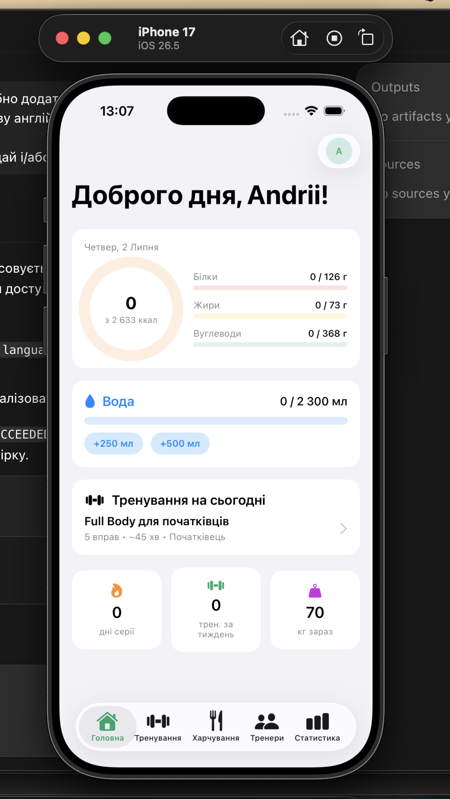

# FitTrack

FitTrack is a SwiftUI fitness tracking app for iOS. It combines onboarding, workout planning, nutrition logging, progress charts, profile goals, theme/language settings, local persistence, and JSON data export in a single offline-first app.

## Features

- **Onboarding**: collects gender, age, height, weight, goal, and activity level, then calculates daily nutrition targets with the Mifflin-St Jeor formula.
- **Dashboard**: calorie ring, macro progress, water tracker, suggested workout, streak, weekly workouts, and current weight.
- **Workouts**: ready-made programs, exercise library with muscle-group filters, custom workout builder, active workout session, rest timer, set logging, and workout history.
- **Nutrition**: daily food diary grouped by meal, built-in food database, custom foods, portion calculator, and day navigation.
- **Stats**: Swift Charts for weight trends, daily calories, workout totals, macro split, and BMI.
- **Profile**: editable goals, achievements, demo data, reset flow, app theme, app language, and JSON export.
- **Local-first storage**: user data is stored on device as JSON in the app Documents directory.

> The trainer feature code is still present in the project, but its tab is currently hidden from the main navigation.

## Screenshots

| Dashboard |
| --- |
|  |

## Tech Stack

- SwiftUI
- Swift Charts
- Codable JSON persistence
- Xcode project generated from `project.yml`
- iOS 17+

## Requirements

- Xcode 15 or newer
- iOS 17 simulator or device
- Optional: [XcodeGen](https://github.com/yonaskolb/XcodeGen) if you want to regenerate the Xcode project from `project.yml`

## Getting Started

Open the checked-in Xcode project:

```bash
open FitTrack.xcodeproj
```

Select an iPhone simulator and run the app with `Cmd + R`.

If you want to regenerate the project file:

```bash
brew install xcodegen
xcodegen generate
open FitTrack.xcodeproj
```

## Data Storage and Export

FitTrack saves app data locally in the app sandbox:

```text
Documents/fittrack.json
```

The saved data includes profile, weight logs, workout sessions, food entries, water entries, custom workouts, custom foods, and trainer bookings if they exist from earlier builds.

To export data from the app:

1. Open **Profile**.
2. Tap the settings gear.
3. Find the **Data** section.
4. Tap **Prepare export file**.
5. Use **Save or share** to export the generated JSON file.

## Project Structure

```text
FitTrack/
├── FitTrackApp.swift        # App entry point and tab navigation
├── Models/Models.swift      # Data models and fitness calculations
├── Store/
│   ├── AppStore.swift       # App state, local persistence, export
│   └── Settings.swift       # Theme, language, and localization helper
├── Data/
│   ├── SeedData.swift       # Built-in exercises, foods, trainers, workouts
│   └── Strings.swift        # English and Ukrainian UI strings
├── Helpers/Helpers.swift    # Shared extensions and reusable UI
└── Views/
    ├── Dashboard/
    ├── Nutrition/
    ├── Onboarding/
    ├── Profile/
    ├── Stats/
    ├── Trainers/
    └── Workouts/
```

## Testing

Build the app from the command line:

```bash
xcodebuild -project FitTrack.xcodeproj \
  -scheme FitTrack \
  -configuration Debug \
  -sdk iphonesimulator \
  -derivedDataPath build \
  CODE_SIGNING_ALLOWED=NO \
  build
```

Run UI tests from Xcode with the `FitTrack` scheme, or from the command line with an available simulator destination.

## Roadmap Ideas

- HealthKit integration for steps, heart rate, and weight sync
- Push reminders for workouts and water
- Barcode scanner for food logging
- Data import from previously exported JSON
- Optional backend sync
